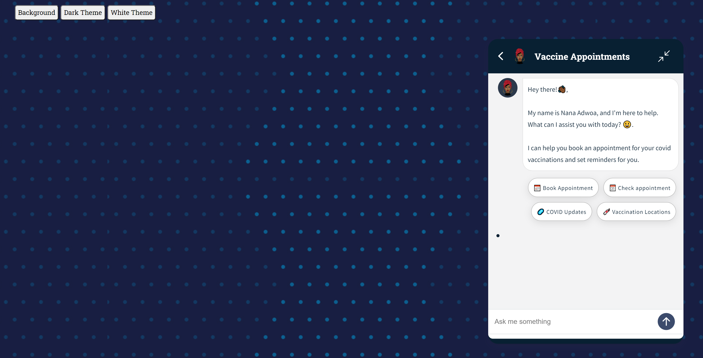
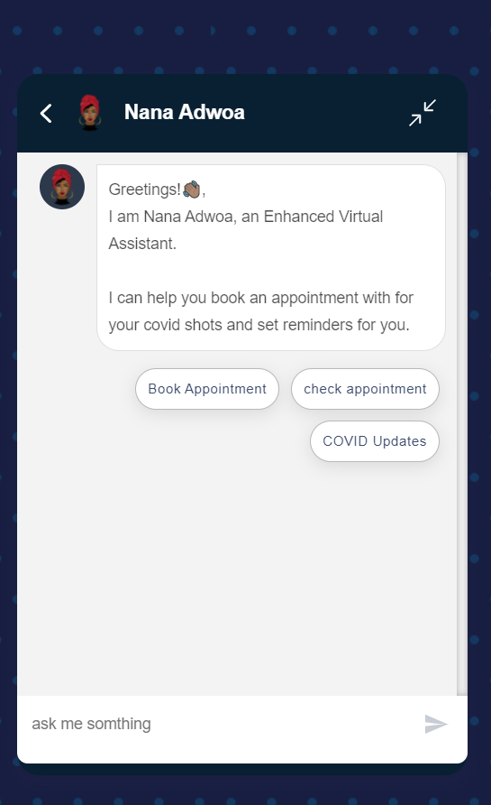
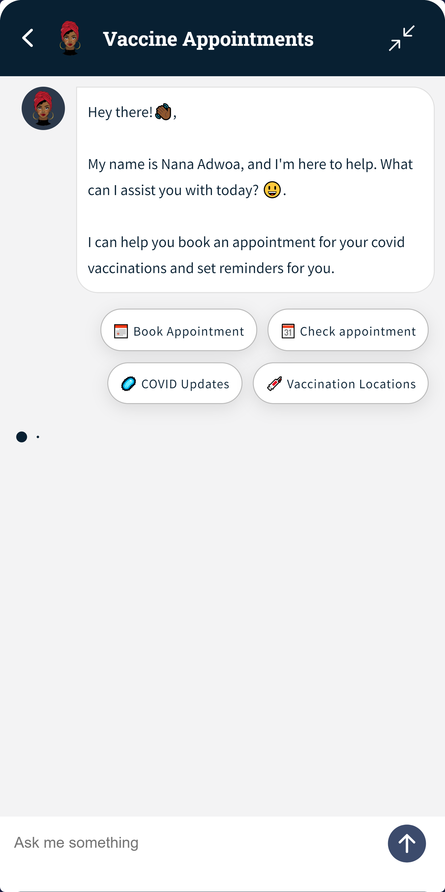
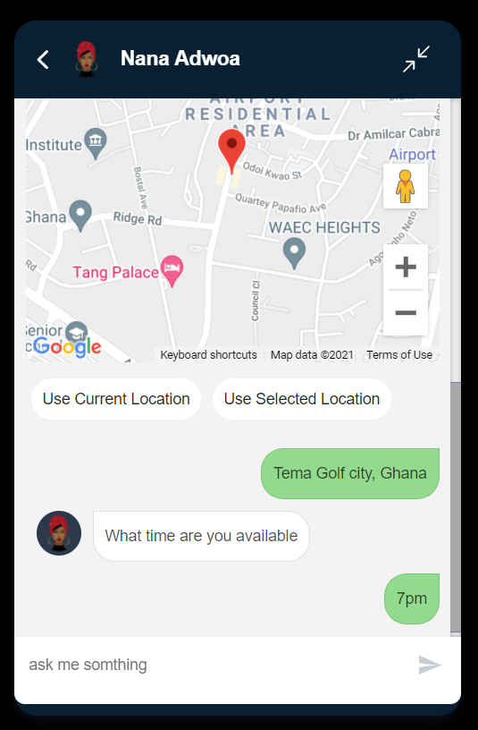

# Covid Vaccine Appointment ChatBot
<!--- Replace <OWNER> with your Github Username and <REPOSITORY> with the name of your repository. -->
<!--- You can find both of these in the url bar when you open your repository in github. -->


## :scroll: Description
A chat bot allowing users to book days with available slots to take covid vaccine. 

## :bulb: Motivation and Context
<!--- Describe your app in one or two sentences -->
COVID-19 infections are increasing in Ghana, with 420 new infections reported on average each day. That's 54% of the peak — the highest daily average reported on July 28. During the last week reported, Ghana averaged about 719 doses administered each day. At that rate, it will take a further 8,460 days to administer enough doses for another 10% of the population.

As taking Vaccines is still in progress, most of the population are busy and would find it difficult going to join long queues to take Vaccines Shot. Even though their health is important, the quality of health service they get also depends on the amount of money they make as such the decision of leaving work for the vaccination becomes difficult to make.


The solution here is simple, a simple conversational assistant or chat bot integrated into all the health service web platforms and also can be deployed as a telephony system where people can book days available for people to take their vaccines shots and schedule the second shot day. [READ MORE](https://github.com/botchway44/covid-vaccine-appointment/blob/main/PROJECT.md)


<br>
<br>
<br>


## :bulb: Motivation and Context
Dialogflow CX Competition
<!--- What are you especially proud of? -->
 

Design shall set conversations free ❤ !!

## 📸 Screenshots


| 1 | 2|
|------|-------|
|||

| 3 | 4|
|------|-------|
|||

## Getting Started

This project is configured to run both the [chat widget]() and an [express application]() together.


A few resources to get you started if this is your first Flutter project:

## License
```
Copyright 2021 Emmanuel Asamoah Botwe

Licensed under the Apache License, Version 2.0 (the "License");
you may not use this file except in compliance with the License.
You may obtain a copy of the License at

    http://www.apache.org/licenses/LICENSE-2.0

Unless required by applicable law or agreed to in writing, software
distributed under the License is distributed on an "AS IS" BASIS,
WITHOUT WARRANTIES OR CONDITIONS OF ANY KIND, either express or implied.
See the License for the specific language governing permissions and
limitations under the License.
```
